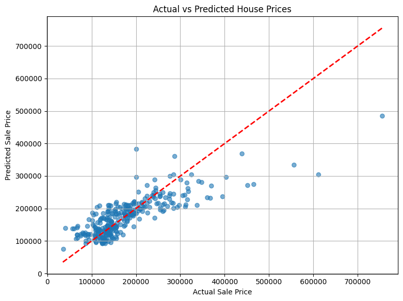

# PRODIGY_ML_01

## 📌Task 1 - House Price Prediction using Linear Regression

This project is part of the Machine Learning Internship at **Prodigy InfoTech**.

### Task Objective:
Build a **Linear Regression** model that predicts housing prices based on:
- `GrLivArea` - Above ground living area (sq ft)
- `BedroomAbvGr` - Bedrooms above ground
- `FullBath` - Number of full bathrooms

### 🛠 Tools & Libraries Used:
- Python
- Google Colab
- pandas, numpy
- scikit-learn
- matplotlib, seaborn

### 📈 Results:
- 📉 Mean Squared Error: 2806426667.247853
- 📊 R² Score: 0.6341189942328371

## 🔗 Open in Google Colab

---

### 📊 Visual:

---

**Internship Domain:** Machine Learning  
**Task No.:** 01  
**Internship Platform:** Prodigy InfoTech
